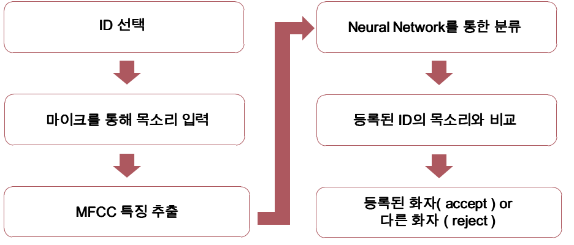
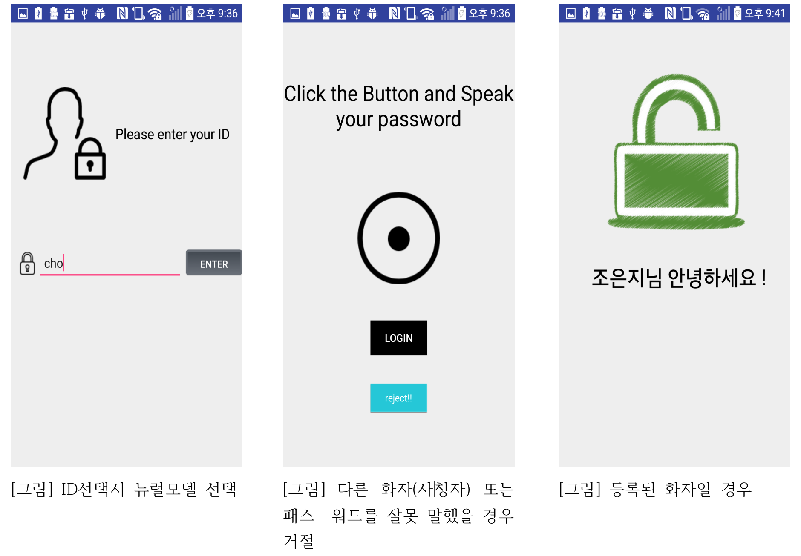
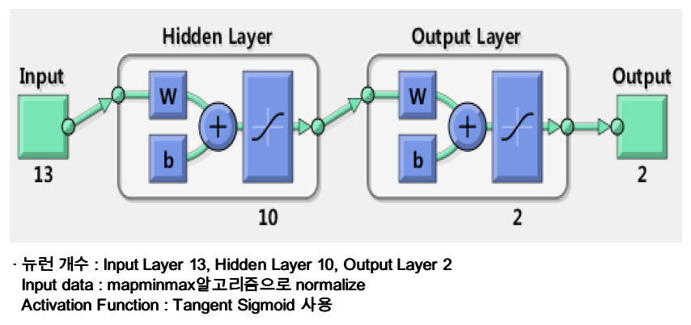
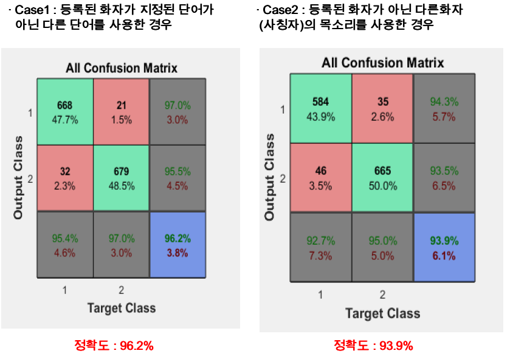

# Voice password
## 2017.09 ~ 2018.01
* Java, Android Studio2.3, Matlab2016 nprtool, Gold wave

* 뉴럴네트워크는 매트랩의 nprtool에서 역전파알고리즘에 의해 학습된 뉴럴 가중치를 사용합니다.

* Android Studio 에서 구현한 네트워크는 Feed Foward Network입니다. 여기에 학습된 뉴럴 가중치를 사용하여 학습된 모델을 만들 수 있습니다.

* MFCC 특징 추출 알고리즘과 음성녹음기능은 open source 를 사용하여 프로젝트에 맞게 수정했습니다.

* 사람마다 음성이 각각 다른 점에서 착안하여 목소리를 패스워드로 활용한 시스템. 
   즉, 사람의 목소리가 패스워드를 대체
   
* Neural Network 
 - 생물의 신경세포와 그 네트워크의 움직임에서 힌트를 얻은 기계 학습 시스템 
 - 분류기로 Feed Forward Neural Network 사용
 
* MFCC(Mel-Frequency Cepstral Coefficients) 
 - 목소리의 특징은 음성신호처리 분야에서 음성의 특성을 표현하기 위해 주로 사용되는 
   MFCC로 특징을 추출

### * 알고리즘

### * 애플리케이션 화면

### * Matlab nprtool

### * Matlab 실험 결과

